# Paint使用说明书

## 软件简介

`Paint`是一款画图软件，基于计算机图形学课程中的图元生成、变换等算法，并且使用`Qt`开发了清爽漂亮、易于交互的`GUI`。

## 开发环境

| 环境         | 配置               |
| ------------ | ----------------- |
| 操作系统     | Windows 10         |
| 编程语言     | C++14              |
| 编译器       | MinGW 7.3.0 32-bit |
| 集成开发环境  | Qt Creator 4.8.2   |

## 界面说明

界面从上至下分为三部分：

* 标题栏：软件图标和名称
* 工具栏：软件提供的丰富功能
* 中心部件：可以尽情泼洒才华的画布

工具栏的工具分为四类：

* 文件操作：包括打开和保存图片
* 绘制图元：包括直线、三角形、矩形、圆形、椭圆、多边形和曲线
* 变换图元：包括平移、旋转、放缩和裁剪
* 其他杂项：包括画笔粗细、调色板、垃圾桶和帮助

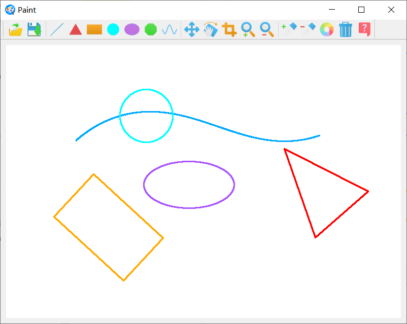

## 操作说明

### 文件操作

#### 打开图片

点击“打开”工具，弹出打开文件对话框，选择图片并确定，可以看到图片在`Paint`中居中显示。

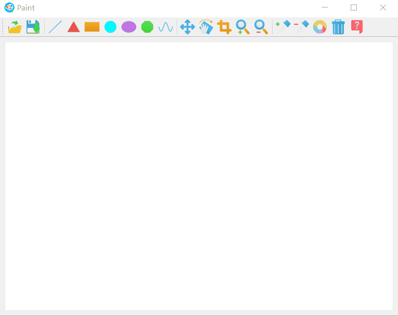

#### 保存图片

点击“保存”工具，弹出保存文件对话框，输入名称并确定，可以在电脑上看到保存的图片。

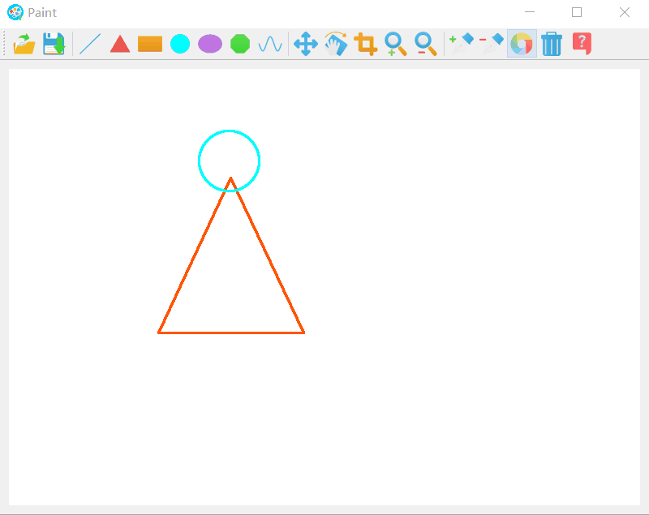

### 绘制图元

#### 直线

点击”直线“工具，在画布上按下鼠标，拖动并松开，软件会在鼠标按下位置和松开位置之间连接直线。

#### 三角形/矩形

点击”三角形“或”矩形“工具，在画布上按下鼠标，拖动并松开，在鼠标按下位置和松开位置构成的边界矩形内绘制等腰三角形或矩形。

#### 圆形/椭圆

点击”圆形“或”椭圆“工具，在画布上按下鼠标，拖动并松开，在鼠标按下位置和松开位置构成的边界矩形内绘制圆形或椭圆。

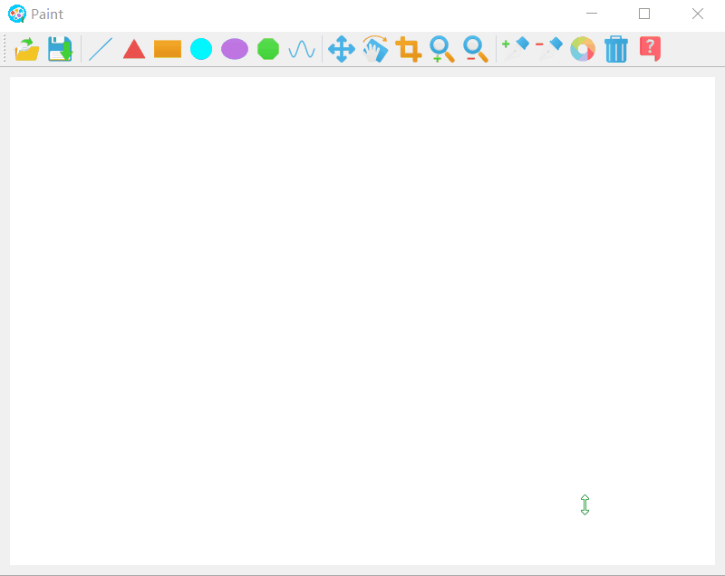

#### 多边形/曲线

点击”多边形“或”曲线“工具，在画布上任意取点，软件根据这些顶点或控制点绘制多边形或曲线。在绘制时这些点会重点显示，当切换到其他模式时，这些点会隐藏。

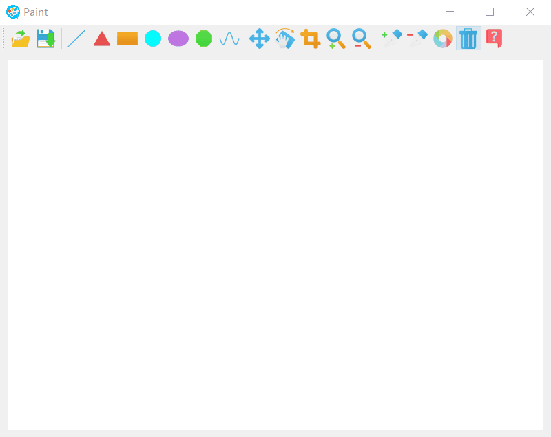

### 变换图元

#### 平移

点击”移动“工具，对准图元上的点按下鼠标并拖动，就可以实现图元的平移。

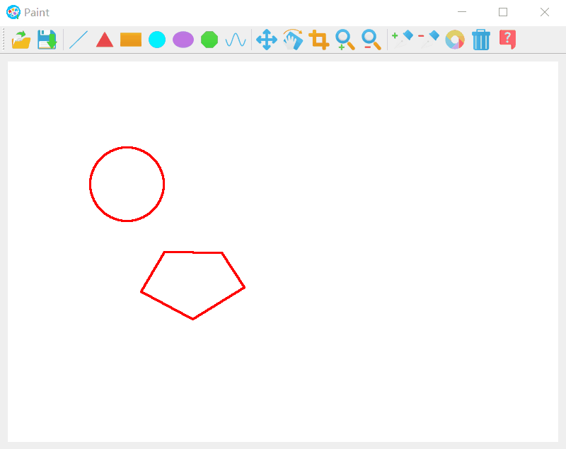

#### 旋转

点击”旋转“工具，对准图元上的点按下鼠标并拖动，图元便会旋转一个角度，这个角度是图元的中心、鼠标按下位置和鼠标当前位置形成的夹角。

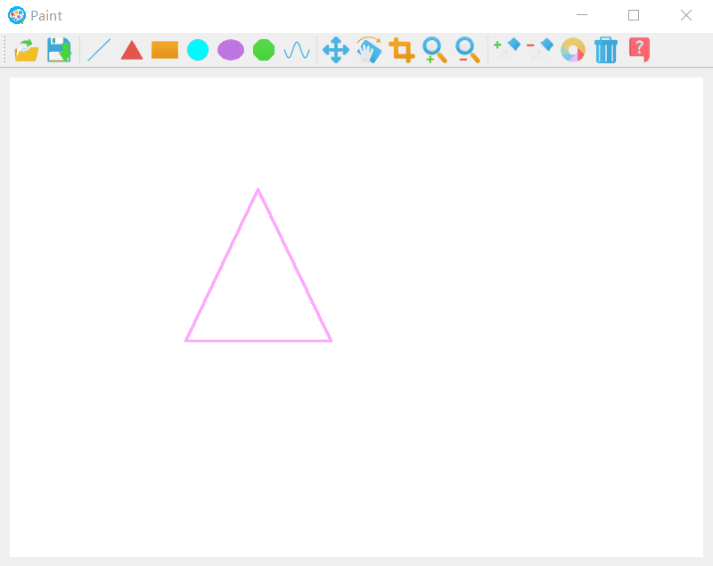

#### 裁剪

点击”裁剪“工具，像绘制矩形一样画出裁剪矩形，图元便会只保留矩形内的部分。

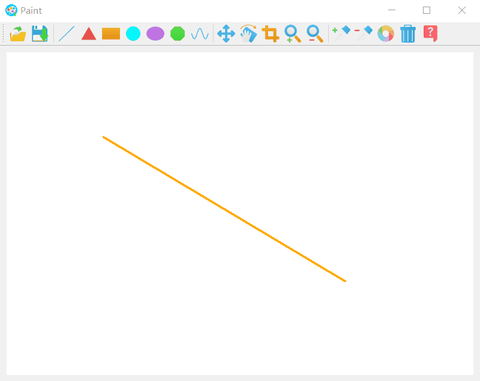

#### 放缩

点击”放大“或”缩小“功能键，对准图元上的点按下，该图元便会放大1.1倍或缩小0.9倍。

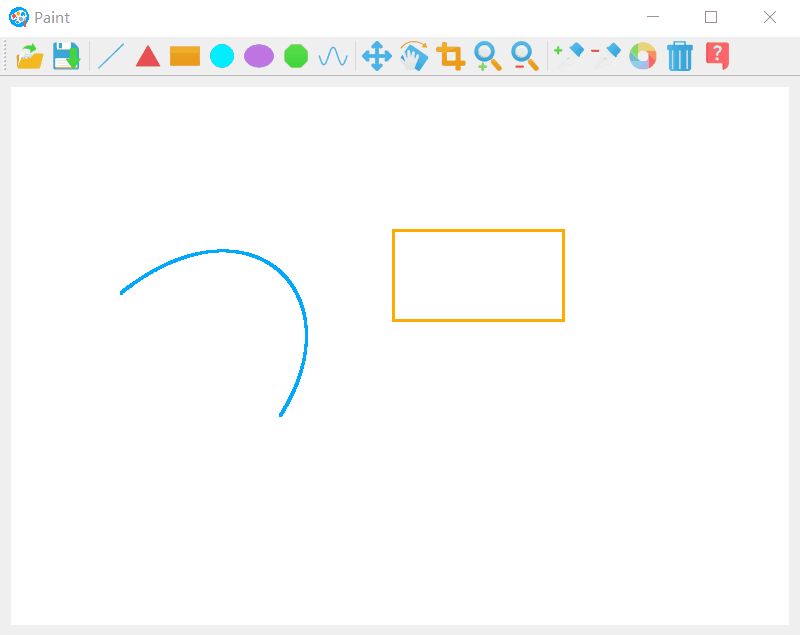

### 其他杂项

#### 画笔粗细

点击”加粗“工具或者”减细“工具，画笔的宽度便会发生相应变化。

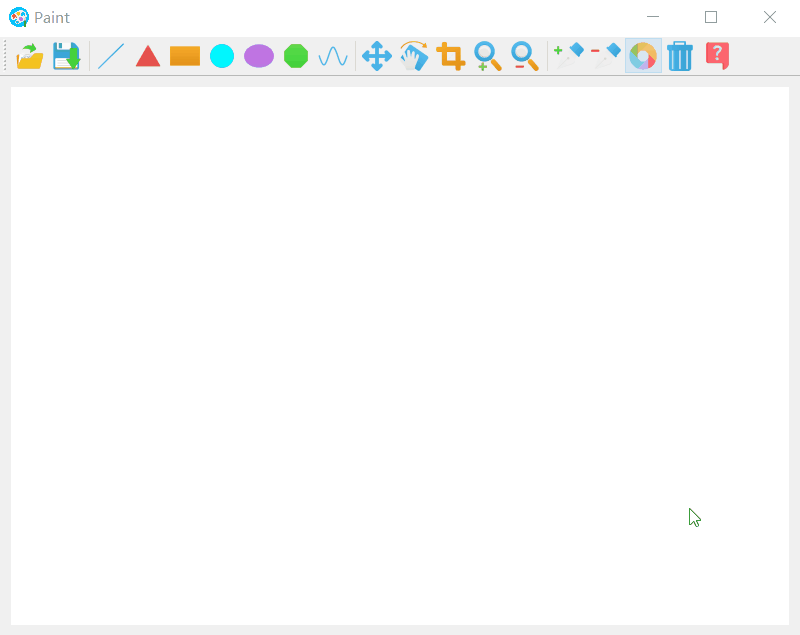

#### 调色板

点击”颜色“工具，打开调色盘挑选画笔颜色。

#### 垃圾桶

点击”删除“工具，对准画布上的图元点击，完成删除。

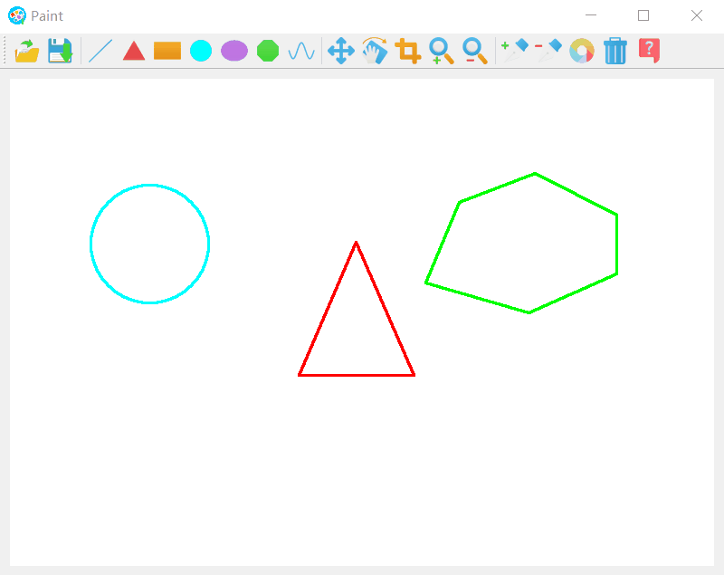